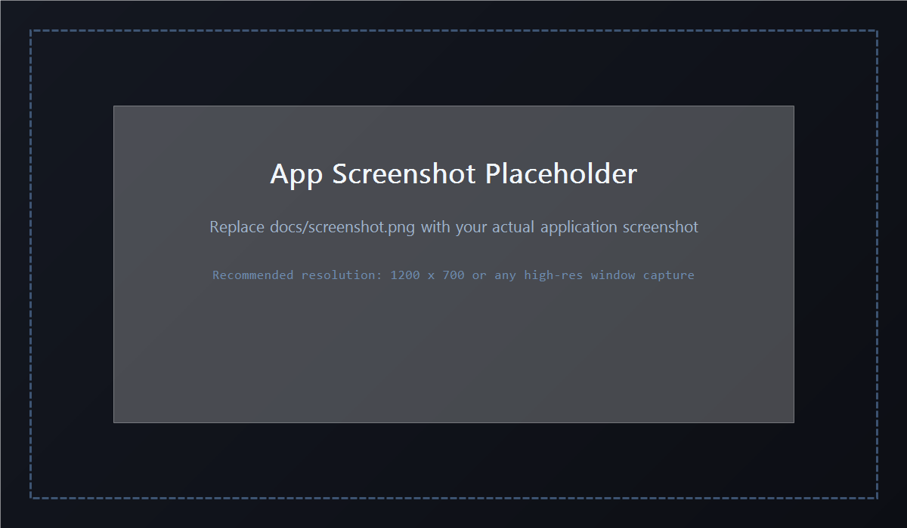

<div align="center">

# Cathet

**A sleek, portable, ultra-lightweight text & markdown editor for Windows with persistent frosted glass.**

[](https://github.com/Crlyzd/Cathet)
[](https://github.com/Crlyzd/Cathet/releases)
[](https://tauri.app)
[](LICENSE)
[](https://github.com/Crlyzd/Cathet/releases/latest)

<br/>

<!-- 
  ======================================================================
  📸 SCREENSHOT PLACEHOLDER
  To add your screenshot:
  1. Capture your app screenshot (e.g. Win + Shift + S).
  2. Save it as 'screenshot.png' inside the 'docs/' directory.
     (Or replace the path below with your desired image URL / path)
  ======================================================================
-->
<p align="center">
  
</p>

*Distraction-free writing wrapped in modern Windows Acrylic blur.*

</div>

---

## ✨ Why Cathet?

Traditional text editors can feel plain and dated, while modern markdown apps often come bloated with heavy Electron runtimes consuming hundreds of megabytes of memory. 

**Cathet** bridges that gap:
- **Instant startup & tiny footprint** — Single portable executable under 5 MB, sipping ~15 MB of RAM.
- **True Acrylic vibrancy** — Translucent frosted glass effect that stays active both in the foreground and background.
- **Dual-mode flexibility** — A lightweight daily scratchpad that transforms into a full Markdown viewer with a single keystroke (`Ctrl + M`).

---

## 🌟 Features

- 🪟 **Persistent Frosted Glass (Acrylic / Mica)**: Native Windows DWM backdrop blur that remains translucent even when the window is unfocused.
- ⚡ **Zero-Bloat Portability**: Completely standalone single `.exe`. No installer, no background services, no registry junk.
- 📝 **Markdown Preview (`Ctrl + M`)**: Effortlessly switch back and forth between raw text editing and formatted Markdown preview.
- 📌 **Always on Top (`Ctrl + T`)**: Keep quick notes, code snippets, or reference material floating neatly above your apps.
- 🎨 **Sleek Themes & Curated Typography**: Clean Dark and Light modes paired with high-legibility developer and reading typefaces (*Inter, JetBrains Mono, Cascadia Code, Fira Code, Roboto, Noto Sans, Consolas, Segoe UI, Arial*).
- 🖱️ **Modern Fluent Context Menu**: Right-click menu crafted with custom frosted glassmorphism matching Windows 11 aesthetics.
- 🔍 **In-App Zoom & Web Search**: Quick font scaling (`Ctrl + MouseWheel`) and instant Google lookup for selected text (`Ctrl + E`).
- 📂 **Drag & Drop**: Drop any `.txt` or `.md` file directly into the window to open it instantly.
- 🔄 **Built-in Auto-Updater**: Discreetly notifies you when a new GitHub release is available and updates in-place without breaking your shortcuts.

---

## 🚀 Download & Quick Start

Cathet requires no installation—just download and launch!

1. Head over to the **[Latest Releases](https://github.com/Crlyzd/Cathet/releases/latest)** page.
2. Download the binary for your system:
   - **`cathet.exe`** — for standard 64-bit Windows PCs (Intel / AMD x64).
   - **`cathet-arm64.exe`** — for Windows on ARM devices (Surface Pro, Snapdragon X Elite).
3. Run the executable and start typing!

> **Tip:** Pin Cathet to your Taskbar or Start Menu for instant access whenever inspiration strikes.

---

## ⌨️ Keyboard Shortcuts

| Shortcut | Action |
| :--- | :--- |
| `Ctrl + M` | **Toggle Markdown Preview** / Raw Edit Mode |
| `Ctrl + T` | **Toggle Always on Top** (Pin Window) |
| `Ctrl + N` | **New Window** instance |
| `Ctrl + O` | **Open** file... |
| `Ctrl + S` | **Save** file |
| `Ctrl + Shift + S` | **Save As**... |
| `Ctrl + ,` | Open **Settings & About** |
| `Ctrl + B` / `I` / `U` | **Bold** / *Italic* / <u>Underline</u> |
| `Ctrl + A` | **Clean Select All** (excludes trailing newline) |
| `Alt + W` / `Ctrl + Shift + W` | Toggle **Word Wrap** |
| `Ctrl + E` | **Search Selected Text** on Google |
| `Ctrl + MouseWheel` | **Zoom** text size in / out |
| `Esc` | **Close** application |

---

## ⚙️ Settings & Customization

Click the three dots (**`···`**) in the top-right corner or press **`Ctrl + ,`** to open Settings:

- **Theme Selection**: Switch between **Dark** and **Light** frosted glass appearances.
- **Font Family**: Pick your favorite coding or prose font from the custom frosted dropdown.
- **Stay on Top**: Toggle persistent window pinning.
- **Check for Updates**: Check against GitHub releases with one-click background upgrade.
- **About & Community**: View credits, report bugs, or support development.

---

## 🛠️ Building from Source (Developers)

If you'd like to build or customize Cathet locally:

### Prerequisites
- [Node.js](https://nodejs.org/) (v18+) & `npm`
- [Rust](https://www.rust-lang.org/tools/install) (latest stable) & Cargo
- PowerShell 5.1+ (built into Windows)

### Automation Pipeline
Cathet includes a unified PowerShell build script (`build.ps1`):

```powershell
# 1. Clone the repository
git clone https://github.com/Crlyzd/Cathet.git
cd Cathet

# 2. Install frontend dependencies
npm install

# 3. Launch live hot-reload development
.\build.ps1 -Live

# 4. Compile a production release (placed into release/)
.\build.ps1 -Build

# 5. Compile for specific architecture targets
.\build.ps1 -BuildX64     # Windows x64
.\build.ps1 -BuildArm64   # Windows ARM64
.\build.ps1 -All          # Both architectures
```

Release binaries are automatically optimized (`opt-level = "z"`, LTO, symbol stripping) and saved to the `release/` directory.

---

## ❤️ Support & Feedback

Cathet is free and open-source. If you find it useful:
- ⭐ Star the project on GitHub
- 🐛 Found an issue? [Submit a bug report](https://github.com/Crlyzd/Cathet/issues)
- ☕ Buy me a coffee via [Saweria](https://saweria.co/crlyzd) or [PayPal](https://paypal.me/crlyzd)

---

## 📄 License

Distributed under the MIT License. See [LICENSE](LICENSE) for more details.
